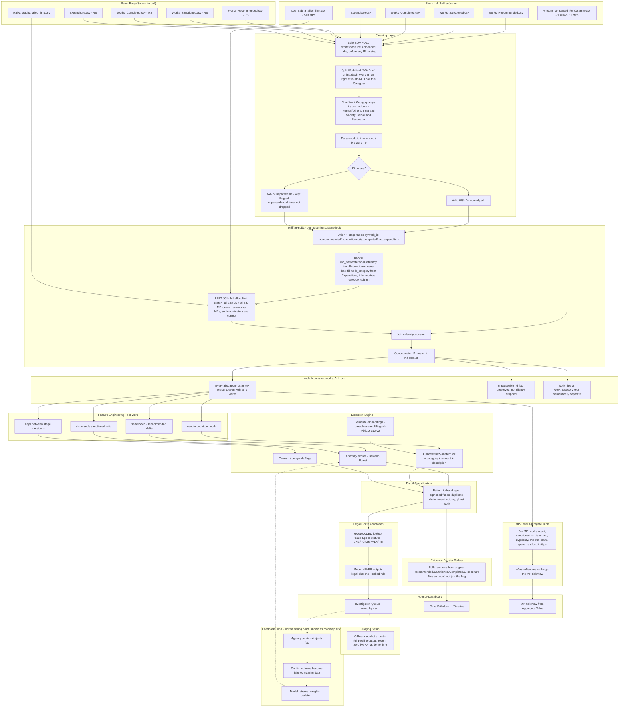

# MPLADS Fraud-Detection System

**SIH 2026 · Smart India Hackathon** — Real-time fraud detection for the **Members of Parliament Local Area Development Scheme (MPLADS)** using public Government of India data.

Built for **government enforcement / investigation agencies** (ED, CBI, CVC, state ACBs) — not a public dashboard. Output is an **investigative evidence trail** that flags suspicious works, states what was done, and points to the applicable legal route.

---

## The Pipeline



**Source file:** `architecture/sih26102_full_architecture.mermaid`

---

## Model Plan — `paraphrase-multilingual-MiniLM-L12-v2` (fine-tune)

**Why this model (not `all-MiniLM-L6-v2`):** our raw data contains **romanized Hindi/regional text typed in English letters** — e.g. `Bhavan/Bhawan`, `Vistar`, `Samudayik`, `Shauchalaya`, `Kharanja`, `Nali Nirman`, plus village names like `Belavatagi`, `Chubba khola`. `all-MiniLM-L6-v2` is English-only and splits `Shauchalaya` into nonsense subwords, so `Bhavan` vs `Bhawan` vs `भवन` look unrelated. The multilingual model was trained on 50+ languages + parallel + code-mixed data, so it correctly maps romanized Hindi ↔ English → duplicate-work detection actually works.

**Size / speed:**
- `paraphrase-multilingual-MiniLM-L12-v2`: **118M params, 12 layers, 384-dim embeddings, ~420 MB on disk.**
- vs `all-MiniLM-L6-v2`: 22M params, 6 layers, ~80 MB — this one is ~5× larger but **same embedding size**, so the pipeline (vector DB, cosine search) is unchanged.
- On our 4 GB VRAM RTX 3050: ~40–60 ms/batch of 32 for encoding; fine-tuning fits with batch 8–16.

**Fine-tune approach:** contrastive/siamese training with `MultipleNegativesRankingLoss` or `CosineSimilarityLoss` on synthetic pairs built from real works (duplicate = positive, random = negative, hard negatives = same MP + same amount + different village). The frozen model already works for the demo — fine-tuning is a stretch goal.

**Hard rule (locked):** the model **NEVER outputs legal citations.** Legal route is appended by a hardcoded lookup table (BNS / PC Act / PMLA / RTI). Model only outputs fraud type + plain-language narrative.

---

## Data

| Source | Rows | Purpose |
|---|---|---|
| Works Recommended / Sanctioned / Completed | 39k / 31k / 34k | Work lifecycle (LS) |
| Expenditure | 30k | Disbursements (LS) |
| Lok Sabha allocation limits | 543 MPs | Denominator + MP budget cap |
| Calamity consent | 13 | Exceptions to allocation limits |
| **Master (built)** — `data/mplads_master_works_v3.csv` | **17,879 × 28** | Canonical table, both chambers, all-roster MPs even with zero works |

Known data quirks (preserved as flags, never silently dropped): `NA-` unparseable work-IDs, mixed romanized-Hindi titles, some column-shifted rows.

---

## Repo Layout

```
mplads/
├── data/                 # raw exports + master CSV (raw/ gitignored)
├── scripts/              # similarity demo, pair builder, fine-tune
├── architecture/         # .mermaid diagrams
├── notebooks/            # EDA / results graphs
├── models/               # trained checkpoints (gitignored — keep on disk/GDrive)
├── analysis/             # problem-statement deep dives
└── ps-2026/              # SIH problem statement source
```

**Trained models live in `models/`** — they are **not** committed to git (large binaries). The `.gitkeep` keeps the folder tracked; weights are re-downloadable or stored externally (e.g. Google Drive).

---

## Getting Started

```bash
# Python >= 3.10, ~4 GB VRAM GPU (or CPU — just slower)
git clone https://github.com/ZeroiJ/mplads.git
cd mplads
python -m venv .venv && source .venv/bin/activate
pip install sentence-transformers torch pandas scikit-learn

# Quick sanity demo: English-only vs multilingual on romanized Hindi titles
python scripts/similarity_demo.py
```

---

## Demo Scope (SIH judging)

- **30–60% MVP**: LS chamber end-to-end, offline snapshot export (zero live API at demo time).
- **Stretch**: RS chamber, fine-tuned model, feedback loop (agency confirmation → labeled data → retrain).